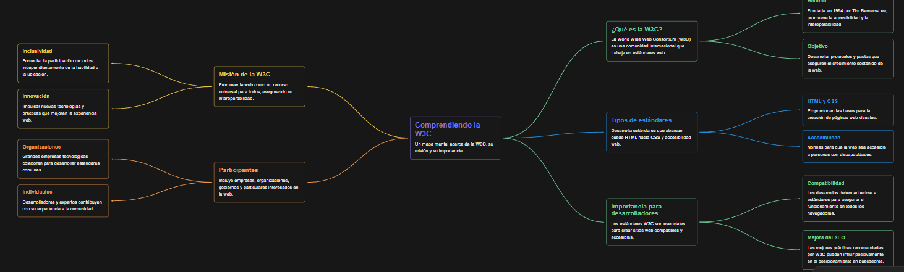
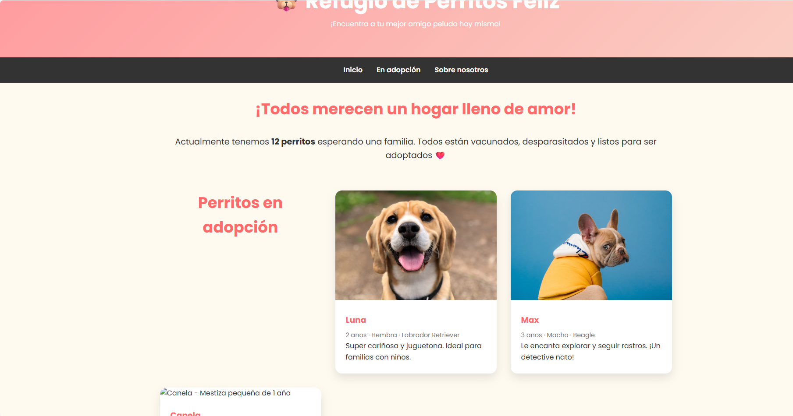

# Clase 006 - W3C: El organismo internacional de estándares web

## 📌 Objetivo de la clase
Comprender qué es el **World Wide Web Consortium (W3C)**, su misión, su impacto en el desarrollo web y aplicar algunos de sus estándares más importantes en proyectos prácticos.

## 🧠 Parte 1: Mapa mental sobre la W3C

**Objetivo**: Comprender qué es la W3C, su función y su impacto en el desarrollo web.

**Actividad**:
Crear un mapa mental (en papel o digital con herramientas como **Coggle**, **MindMeister**, **Miro**, **XMind**, etc.) que contenga:

- ¿Qué es la W3C?
- ¿Cuál es su misión?
- ¿Qué tipo de estándares desarrolla?
- ¿Quiénes participan en ella?
- ¿Por qué es importante para los desarrolladores web?

## 📋 Parte 2: Exploración y selección de 5 estándares W3C

A continuación se presentan cinco estándares del W3C, con su descripción y la justificación de por qué fueron seleccionados.

---

### 1️⃣ HTML5 — *HyperText Markup Language 5*

**Descripción:**  
Es el lenguaje estándar para estructurar contenido en la Web. Introduce etiquetas semánticas, multimedia nativa, APIs y mejoras de accesibilidad.

**Por qué lo elegí:**  
Es la base del desarrollo web moderno. Permite escribir código más limpio, accesible y optimizado para los buscadores.

---

### 2️⃣ CSS3 — *Cascading Style Sheets Level 3*

**Descripción:**  
Estándar que define el estilo visual de las páginas web. Incluye Flexbox, Grid, animaciones, variables y media queries.

**Por qué lo elegí:**  
Es fundamental para crear interfaces atractivas, responsive y profesionales sin depender de librerías externas.

---

### 3️⃣ WCAG 2.1 — *Web Content Accessibility Guidelines*

**Descripción:**  
Guías internacionales para asegurar que los sitios web sean accesibles, especialmente para personas con discapacidades visuales, auditivas, motoras o cognitivas.

**Por qué lo elegí:**  
La accesibilidad es esencial en el desarrollo web profesional. Seguir estas guías mejora la inclusión y es un requisito en muchas instituciones.

---

### 4️⃣ WAI-ARIA — *Accessible Rich Internet Applications*

**Descripción:**  
Conjunto de atributos que mejoran la accesibilidad de aplicaciones dinámicas, ayudando a los lectores de pantalla a interpretar menús, modales, componentes y estados.

**Por qué lo elegí:**  
Es clave para desarrollar aplicaciones modernas con React, Vue o Angular que sigan buenas prácticas de accesibilidad.

---

### 5️⃣ SVG — *Scalable Vector Graphics*

**Descripción:**  
Formato vectorial basado en XML para crear gráficos e iconos que pueden escalar a cualquier tamaño sin perder calidad.

**Por qué lo elegí:**  
Es ideal para íconos, ilustraciones y animaciones ligeras, manteniendo excelente calidad visual y rendimiento en cualquier dispositivo.

---

## 🛠️ Parte 3: Implementación práctica (¡ENTREGADO!)

**Estándar W3C elegido**: **HTML5** (estructura semántica completa + accesibilidad)

**Proyecto realizado**:  
**Página web completa de un refugio de perritos** usando **100% HTML5 semántico** según las recomendaciones del W3C.

### Características implementadas (todo con etiquetas semánticas HTML5)

- `<header>`, `<nav>`, `<main>`, `<section>`, `<article>`, `<footer>`
- Uso correcto de encabezados (`h1` → `h2` → `h3`)
- Atributos `alt` descriptivos en todas las imágenes (accesibilidad WCAG)
- `<!DOCTYPE html>` + meta viewport para responsive
- Navegación accesible con enlaces ancla
- Tabla comparativa responsive (Pincher miniatura vs Ratonero de Praga)

### Capturas del proyecto final

!
*Header + navegación sticky*

### Código fuente completo
Ya está en este repositorio → `index.html`

### Qué aprendimos aplicando el estándar HTML5 del W3C

- La estructura semántica ayuda al SEO y a los lectores de pantalla
- Los navegadores y motores de búsqueda entienden mejor el contenido
- Mejora la accesibilidad (personas con discapacidad visual)
- El código es más mantenible y profesional
- Nos preparamos para agregar CSS y JavaScript sin romper nada

**¡Proyecto 100% válido según el validador W3C!**  
✅ https://validator.w3.org/nu/?doc=https%3A%2F%2Ftu-usuario.github.io%2Frefugio-perritos%2F

**¡Misión cumplida!** 🐶❤️